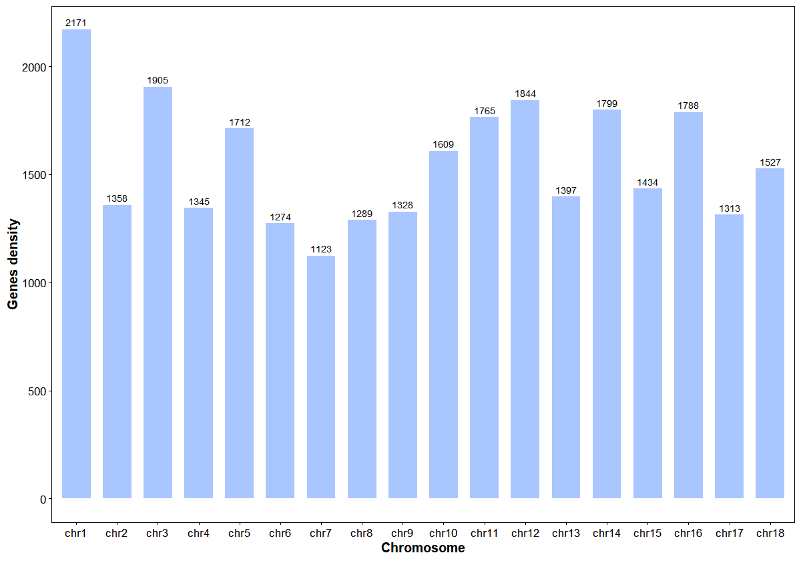
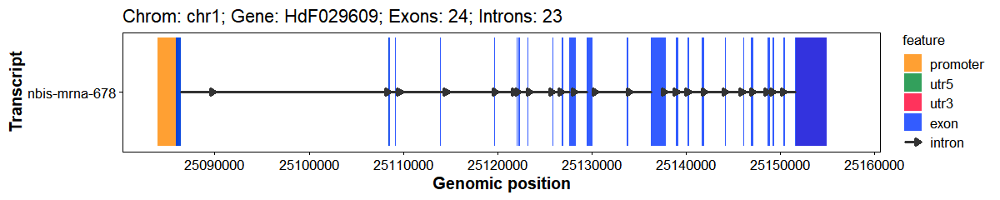
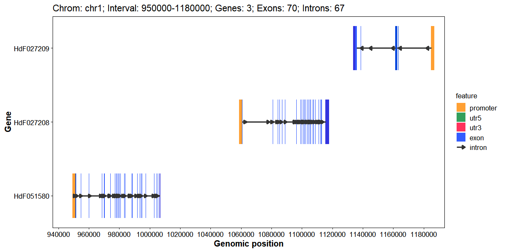
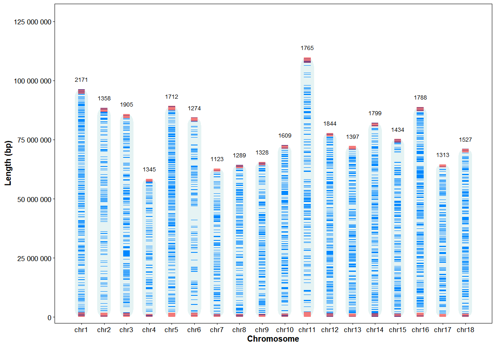
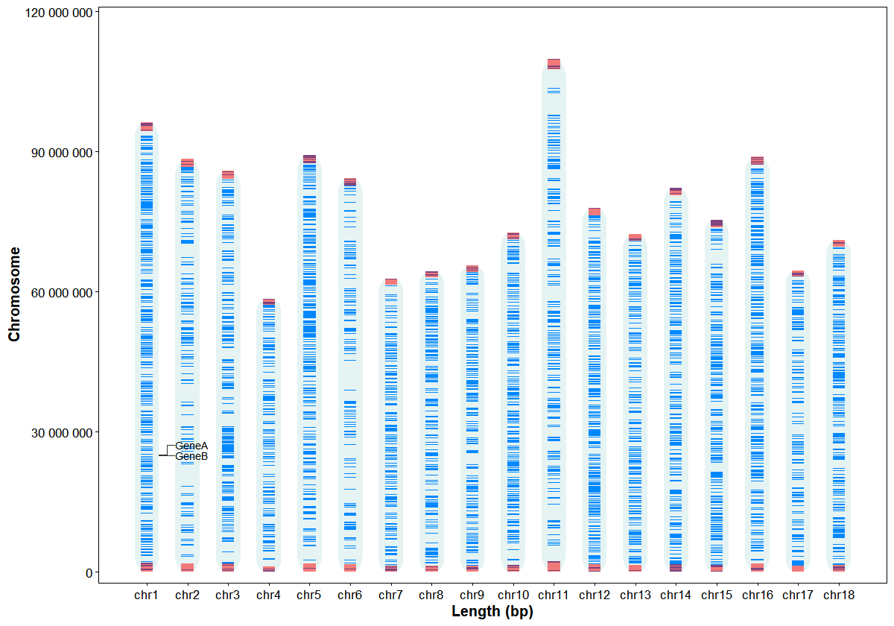
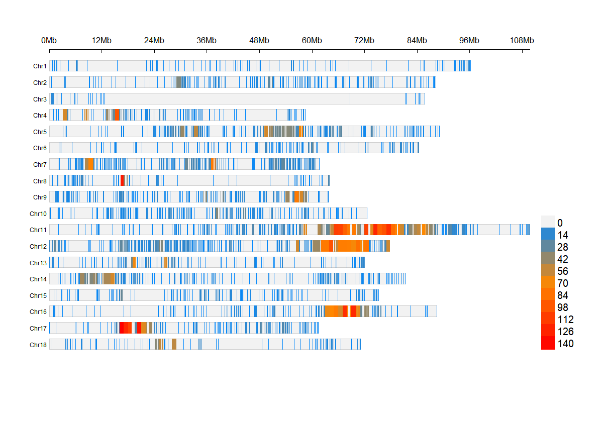
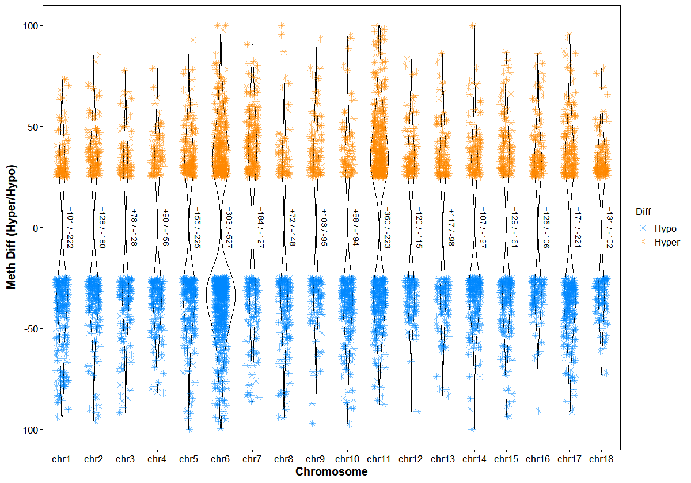

GAnnoViz
================

- [GAnnoViz](#gannoviz)
  - [1. Introduction](#1-introduction)
  - [2. Installation](#2-installation)
  - [3. Shiny App](#3-shiny-app)
  - [4. Usages](#4-usages)

# GAnnoViz

## 1. Introduction

**SourceCode:** <https://github.com/benben-miao/GAnnoViz/>

**Website API**: <https://benben-miao.github.io/GAnnoViz/>

GAnnoViz: a R package for genomic annotation and visualization.

## 2. Installation

## 3. Shiny App

``` r
# GAnnoVizApp()
```

## 4. Usages

### Extract Genes

``` r
# Example GFF3 file in GAnnoViz
gff_file <- system.file(
  "extdata",
  "example.gff",
  package = "GAnnoViz")

# Extract Genes
# genes <- extract_genes(
#   gff_file = gff_file,
#   format = "auto",
#   gene_info = "all")
# genes

# Gene info: gene_range
gene_range <- extract_genes(
  gff_file = gff_file,
  format = "auto",
  gene_info = "gene_range")
head(gene_range)
#> IRanges object with 6 ranges and 0 metadata columns:
#>                 start       end     width
#>             <integer> <integer> <integer>
#>   HdF000001  10724003  10725460      1458
#>   HdF000002  10808174  10823308     15135
#>   HdF000003  10911391  10930352     18962
#>   HdF000004  10939872  10941326      1455
#>   HdF000005  10982117  10999259     17143
#>   HdF000006  11012358  11024009     11652
```

### Extract CDS

``` r
# Extract CDS
# cds <- extract_cds(
#   gff_file = gff_file,
#   format = "auto",
#   cds_info = "all")
# cds

# CDS info: cds_range
cds_range <- extract_cds(
  gff_file = gff_file,
  format = "auto",
  cds_info = "cds_range")
head(cds_range)
#> IRanges object with 6 ranges and 0 metadata columns:
#>           start       end     width
#>       <integer> <integer> <integer>
#>   [1]    810081    810090        10
#>   [2]    816466    816734       269
#>   [3]    818765    818971       207
#>   [4]    819680    819740        61
#>   [5]    821042    821214       173
#>   [6]    825267    825329        63
```

### Extract Promoters

``` r
# Extract Promoters
# promoters <- extract_promoters(
#   gff_file = gff_file,
#   format = "auto",
#   upstream = 2000,
#   downstream = 200,
#   promoter_info = "all")
# promoters

# Promoter info: promoter_range
promoter_range <- extract_promoters(
  gff_file = gff_file,
  format = "auto",
  upstream = 2000,
  downstream = 200,
  promoter_info = "promoter_range")
head(promoter_range)
#> IRanges object with 6 ranges and 0 metadata columns:
#>                     start       end     width
#>                 <integer> <integer> <integer>
#>   nbis-mrna-126    807987    810186      2200
#>   nbis-mrna-127    882426    884625      2200
#>   nbis-mrna-129    949197    951396      2200
#>   nbis-mrna-130   1058746   1060945      2200
#>   nbis-mrna-132   1184302   1186501      2200
#>   nbis-mrna-134   1259096   1261295      2200
```

### Extract 5’UTR

``` r
# Extract 5'UTR
# utr5 <- extract_utr5(
#   gff_file = gff_file,
#   format = "auto",
#   utr5_info = "all")
# utr5

# 5'UTR info: utr5_range
utr5_range <- extract_utr5(
  gff_file = gff_file,
  format = "auto",
  utr5_info = "utr5_range")
head(utr5_range)
#> IRanges object with 6 ranges and 0 metadata columns:
#>         start       end     width
#>     <integer> <integer> <integer>
#>   1    809987    810080        94
#>   2    884426    884645       220
#>   3    951197    951558       362
#>   3    952741    952756        16
#>   4   1060746   1060848       103
#>   6   1261096   1261128        33
```

### Plot gene stats for chromosomes

``` r
# Plot gene stats
plot_gene_stats(
    gff_file = gff_file,
    format = "auto",
    bar_width = 0.7,
    bar_color = "#0055ff55",
    lable_size = 3)
```



### Plot gene structure (Promoter, 3’UTR, Exon, Intron, 5’UTR)

``` r
# Plot gene structure
plot_gene_structure(
  gff_file = gff_file,
  format = "auto",
  gene_id = "HdF029609",
  upstream = 2000,
  downstream = 200,
  feature_alpha = 0.8,
  intron_width = 1,
  x_breaks = 10,
  arrow_length = 5,
  arrow_count = 1,
  arrow_unit = "pt",
  promoter_color = "#ff8800",
  utr5_color = "#008833",
  utr3_color = "#ff0033",
  exon_color = "#0033ff",
  intron_color = "#333333"
)
```



### Plot gene structures for a genomic interval

``` r
# Plot interval structure
plot_interval_structure(
  gff_file = gff_file,
  format = "auto",
  chrom_id = "chr1",
  start = 950000,
  end = 1180000,
  x_breaks = 10,
  upstream = 2000,
  downstream = 200,
  feature_alpha = 0.8,
  intron_width = 1,
  arrow_count = 1,
  arrow_length = 5,
  arrow_unit = "pt",
  promoter_color = "#ff8800",
  utr5_color = "#008833",
  utr3_color = "#ff0033",
  exon_color = "#0033ff",
  intron_color = "#333333"
)
```



### Plot chromosome structures and gene stats

``` r
# Plot chrom structure
plot_chrom_structure(
  gff_file = gff_file,
  format = "auto",
  orientation = "vertical",
  bar_width = 0.6,
  chrom_alpha = 0.1,
  gene_width = 0.5,
  chrom_color = "#008888",
  gene_color = "#0088ff",
  telomere_color = "#ff0000",
  label_size = 3
)
```



### Plot chromosome structures and gene annotation

``` r
genes <- data.frame(
  gene_id = c("HdF029609", "HdF029610"),
  gene_name = c("GeneA", "GeneB"))

# Vertical, annotate by name
plot_chrom_genes(
  gff_file = gff_file,
  gene_table = genes,
  annotate = "name",
  orientation = "vertical")
```



### Annotate differentially expressed genes (DEGs) with chromosome positions

``` r
# Example DEGs GAnnoViz
deg_file <- system.file(
  "extdata",
  "example.deg",
  package = "GAnnoViz")

deg <- read.table(
  file = deg_file,
  header = TRUE,
  sep = "\t",
  na.strings = NA,
  stringsAsFactors = FALSE
)
head(deg)
#>      GeneID    baseMean log2FoldChange     lfcSE      stat       pvalue
#> 1 HdF054777   16.999581      -1.480620 0.7189789 -2.059337 3.946195e-02
#> 2 HdF055254   10.012632       3.039624 1.3467639  2.256984 2.400909e-02
#> 3 HdF055463    3.926022       5.319215 2.2806921  2.332281 1.968590e-02
#> 4 HdF027237 1433.976916      -1.802171 0.3336465 -5.401438 6.610888e-08
#> 5 HdF027261  178.124271      -1.049145 0.4681808 -2.240897 2.503274e-02
#> 6 HdF002748  185.015989       2.051539 0.9494449  2.160778 3.071251e-02
#>           padj
#> 1 5.479174e-01
#> 2 4.341369e-01
#> 3           NA
#> 4 2.832689e-05
#> 5 4.406169e-01
#> 6 4.865774e-01
```

``` r
# Annotate DEGs with chromosome positions
res <- anno_deg_chrom(
  deg_file = deg_file,
  gff_file = gff_file,
  format = "auto",
  id_col = "GeneID",
  fc_col = "log2FoldChange",
  use_strand = FALSE,
  drop_unmapped = TRUE
)
head(res)
#>   chrom    start      end   gene_id     score strand
#> 1 chr14 12802589 12807112 HdF000031  1.408356      *
#> 2 chr14 12979855 12984114 HdF000041 -1.114777      *
#> 3 chr14 13092225 13094734 HdF000049  1.271638      *
#> 4 chr14 13915421 13919063 HdF000066 -6.180426      *
#> 5 chr14 15038730 15050966 HdF000091 -1.250090      *
#> 6 chr14 15455652 15456778 HdF000106 -6.085891      *
```

### Plot differentially expressed genes (DEGs) hyper/hypo distributions by chromosome

``` r
# Plot chrom DEGs
plot_chrom_deg(
  deg_file = deg_file,
  gff_file = gff_file,
  format = "auto",
  id_col = "GeneID",
  fc_col = "log2FoldChange",
  violin_scale = "count",
  violin_border = 0.5,
  point_shape = 16,
  point_size = 2,
  jitter_width = 0.2,
  hyper_color = "#ff000088",
  hypo_color = "#00880088"
)
```


### Annotate FST slide windows with genomic features

``` r
# Annotate FST
fst_table <- system.file(
    "extdata",
    "example.fst",
    package = "GAnnoViz")

fst <- read.table(
  file = fst_table,
  header = TRUE,
  sep = "\t",
  na.strings = "NA",
  stringsAsFactors = FALSE
)
head(fst)
#>   CHROM BIN_START BIN_END N_VARIANTS WEIGHTED_FST    MEAN_FST
#> 1 chr11     10001   20000          7   0.04366440  0.02391140
#> 2 chr11     15001   25000          7   0.04366440  0.02391140
#> 3 chr11     25001   35000          4   0.01503910  0.01619730
#> 4 chr11     30001   40000          4   0.01503910  0.01619730
#> 5 chr11     55001   65000          1  -0.00444874 -0.00444874
#> 6 chr11     60001   70000          1  -0.00444874 -0.00444874
```

``` r
res <- anno_fst_dmr(
  gff_file = gff_file,
  format = "auto",
  genomic_ranges = fst_table,
  chrom_col = "CHROM",
  start_col = "BIN_START",
  end_col = "BIN_END",
  upstream = 2000,
  downstream = 200,
  ignore_strand = TRUE,
  features = c("promoter", "UTR5", "gene", "exon", "intron", "CDS", "UTR3", "intergenic")
)
head(res)
#>   CHROM BIN_START BIN_END N_VARIANTS WEIGHTED_FST    MEAN_FST
#> 1 chr11     10001   20000          7   0.04366440  0.02391140
#> 2 chr11     15001   25000          7   0.04366440  0.02391140
#> 3 chr11     25001   35000          4   0.01503910  0.01619730
#> 4 chr11     30001   40000          4   0.01503910  0.01619730
#> 5 chr11     55001   65000          1  -0.00444874 -0.00444874
#> 6 chr11     60001   70000          1  -0.00444874 -0.00444874
#>                                 anno_type                   gene_id
#> 1 promoter,gene,UTR5,CDS,exon,intron,UTR3 HdF041849(p),HdF041849(g)
#> 2          promoter,gene,UTR5,exon,intron HdF041849(p),HdF041849(g)
#> 3                              intergenic                          
#> 4                              intergenic                          
#> 5                              intergenic                          
#> 6                              intergenic
```

### Annotate DMR slide windows with genomic features

``` r
# Annotate DMR
dmr_table <- system.file(
    "extdata",
    "example.dmr",
    package = "GAnnoViz")

dmr <- read.table(
  file = dmr_table,
  header = TRUE,
  sep = "\t",
  na.strings = "NA",
  stringsAsFactors = FALSE
)
head(dmr)
#>    chr   start     end strand        pvalue        qvalue meth.diff
#> 1 chr1  466001  468000      *  4.157118e-03  1.206712e-02 -27.31707
#> 2 chr1  660001  662000      *  4.041133e-09  3.622605e-08 -33.37925
#> 3 chr1 1454001 1456000      *  8.939178e-12  1.083862e-10 -26.55631
#> 4 chr1 2750001 2752000      * 2.716109e-129 5.710428e-127  25.04745
#> 5 chr1 3428001 3430000      *  2.049072e-10  2.144328e-09 -46.33124
#> 6 chr1 3604001 3606000      *  2.137854e-09  1.984104e-08  37.85743
```

``` r
res <- anno_fst_dmr(
  gff_file = gff_file,
  format = "auto",
  genomic_ranges = dmr_table,
  chrom_col = "chr",
  start_col = "start",
  end_col = "end",
  upstream = 2000,
  downstream = 200,
  ignore_strand = TRUE,
  features = c("promoter", "UTR5", "gene", "exon", "intron", "CDS", "UTR3", "intergenic")
)
head(res)
#>    chr   start     end strand        pvalue        qvalue meth.diff
#> 1 chr1  466001  468000      *  4.157118e-03  1.206712e-02 -27.31707
#> 2 chr1  660001  662000      *  4.041133e-09  3.622605e-08 -33.37925
#> 3 chr1 1454001 1456000      *  8.939178e-12  1.083862e-10 -26.55631
#> 4 chr1 2750001 2752000      * 2.716109e-129 5.710428e-127  25.04745
#> 5 chr1 3428001 3430000      *  2.049072e-10  2.144328e-09 -46.33124
#> 6 chr1 3604001 3606000      *  2.137854e-09  1.984104e-08  37.85743
#>        anno_type      gene_id
#> 1    gene,intron HdF051575(g)
#> 2    gene,intron HdF051575(g)
#> 3 gene,exon,UTR3 HdF027216(g)
#> 4     intergenic             
#> 5    gene,intron HdF027234(g)
#> 6    gene,intron HdF027242(g)
```

### Plot SNP density at chromosome level

``` r
# Plot SNP density
plot_chrom_snp(
  fst_file = fst_table,
  LOG10 = FALSE,
  bin_size = 1e6,
  density_color = c("#0088ff", "#ff8800", "#ff0000")
)
```



### Plot differentially methylated regions (DMRs) hyper/hypo distributions by chromosome

``` r
# Plot chrom DMRs
plot_chrom_dmr(
  dmr_file = dmr_table,
  violin_scale = "count",
  violin_border = 0.5,
  point_shape = 8,
  point_size = 2,
  jitter_width = 0.2,
  hyper_color = "#ff880088",
  hypo_color = "#0088ff88"
)
```


