SeuratVisPro
================

- [SeuratVisPro](#seuratvispro)
  - [1. Introduction](#1-introduction)
  - [2. Installation](#2-installation)
  - [3. Shiny App](#3-shiny-app)
  - [4. Usages](#4-usages)

# SeuratVisPro

## 1. Introduction

**SourceCode:** <https://github.com/benben-miao/SeuratVisPro/>

**Website API**: <https://benben-miao.github.io/SeuratVisPro/>

SeuratVisPro is an innovative visualization and diagnostic toolkit for
Seurat v5. It provides cluster stability assessment, batch mixing
diagnostics, marker atlas visualization, ligand–receptor directional
scoring, gene trend plotting, dendrograms with similarity heatmaps,
spatial overlays with non-spatial fallbacks, module score visualization,
cell cycle views, and more. An optional bs4Dash Shiny app is bundled for
interactive exploration.

## 2. Installation

``` r
# From GitHub
# install.packages("remotes")
# remotes::install_github("benben-miao/SeuratVisPro")

library(SeuratVisPro)
#> SeuratVisPro 0.1.0 - Innovative Seurat v5 visualization toolkit
library(Seurat)
#> Loading required package: SeuratObject
#> Loading required package: sp
#> 
#> Attaching package: 'SeuratObject'
#> The following objects are masked from 'package:base':
#> 
#>     intersect, t
library(ggplot2)
```

## 3. Shiny App

``` r
launchSeuratVisPro()
```

## 4. Usages

### Example Data

``` r
obj <- SeuratVisProExample(
  n_cells = 300,
  n_genes = 1000,
  n_clusters = 10,
  seed = 123,
  genes_mt = "^MT-",
  neighbor_dims = 10,
  cluster_res = 0.5,
  umap_dims = 10,
  spatial = FALSE
)
#> Modularity Optimizer version 1.3.0 by Ludo Waltman and Nees Jan van Eck
#> 
#> Number of nodes: 300
#> Number of edges: 4508
#> 
#> Running Louvain algorithm...
#> Maximum modularity in 10 random starts: 0.9485
#> Number of communities: 10
#> Elapsed time: 0 seconds
#> Warning: The default method for RunUMAP has changed from calling Python UMAP via reticulate to the R-native UWOT using the cosine metric
#> To use Python UMAP via reticulate, set umap.method to 'umap-learn' and metric to 'correlation'
#> This message will be shown once per session

Seurat::DimPlot(obj, group.by = "cluster")
```

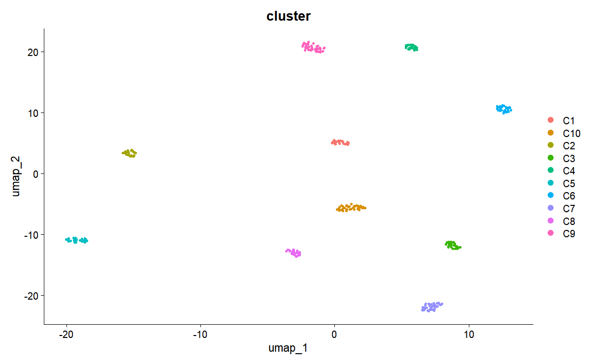<!-- -->

### VisQCPanel

``` r
p <- VisQCPanel(
  obj,
  assay = NULL,
  genes_mt = "^MT-",
  genes_ribo = "^RPL|^RPS",
  group.by = "seurat_clusters",
  interactive = FALSE,
  palette = "C",
  violin_width = 0.8,
  violin_alpha = 0.3,
  box_width = 0.3,
  box_alpha = 0.5
)

p
```

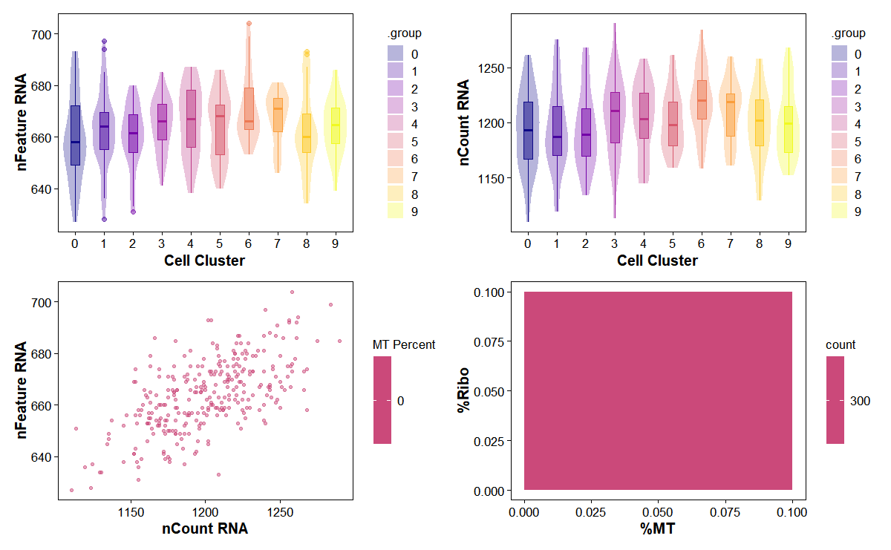<!-- -->

### VisClusterStability

``` r
res <- VisClusterStability(
  obj,
  resolution_range = seq(0.2, 1.2, by = 0.2),
  dims = 1:10,
  reps = 5,
  prop = 0.8,
  palette = "C"
)
#> Computing nearest neighbor graph
#> Computing SNN
#> Modularity Optimizer version 1.3.0 by Ludo Waltman and Nees Jan van Eck
#> 
#> Number of nodes: 300
#> Number of edges: 4508
#> 
#> Running Louvain algorithm...
#> Maximum modularity in 10 random starts: 0.9794
#> Number of communities: 10
#> Elapsed time: 0 seconds
#> Modularity Optimizer version 1.3.0 by Ludo Waltman and Nees Jan van Eck
#> 
#> Number of nodes: 300
#> Number of edges: 4508
#> 
#> Running Louvain algorithm...
#> Maximum modularity in 10 random starts: 0.9588
#> Number of communities: 10
#> Elapsed time: 0 seconds
#> Modularity Optimizer version 1.3.0 by Ludo Waltman and Nees Jan van Eck
#> 
#> Number of nodes: 300
#> Number of edges: 4508
#> 
#> Running Louvain algorithm...
#> Maximum modularity in 10 random starts: 0.9381
#> Number of communities: 10
#> Elapsed time: 0 seconds
#> Modularity Optimizer version 1.3.0 by Ludo Waltman and Nees Jan van Eck
#> 
#> Number of nodes: 300
#> Number of edges: 4508
#> 
#> Running Louvain algorithm...
#> Maximum modularity in 10 random starts: 0.9175
#> Number of communities: 10
#> Elapsed time: 0 seconds
#> Modularity Optimizer version 1.3.0 by Ludo Waltman and Nees Jan van Eck
#> 
#> Number of nodes: 300
#> Number of edges: 4508
#> 
#> Running Louvain algorithm...
#> Maximum modularity in 10 random starts: 0.8969
#> Number of communities: 10
#> Elapsed time: 0 seconds
#> Modularity Optimizer version 1.3.0 by Ludo Waltman and Nees Jan van Eck
#> 
#> Number of nodes: 300
#> Number of edges: 4508
#> 
#> Running Louvain algorithm...
#> Maximum modularity in 10 random starts: 0.8763
#> Number of communities: 10
#> Elapsed time: 0 seconds
#> Modularity Optimizer version 1.3.0 by Ludo Waltman and Nees Jan van Eck
#> 
#> Number of nodes: 300
#> Number of edges: 4508
#> 
#> Running Louvain algorithm...
#> Maximum modularity in 10 random starts: 0.9794
#> Number of communities: 10
#> Elapsed time: 0 seconds
#> Computing nearest neighbor graph
#> Computing SNN
#> Modularity Optimizer version 1.3.0 by Ludo Waltman and Nees Jan van Eck
#> 
#> Number of nodes: 240
#> Number of edges: 2831
#> 
#> Running Louvain algorithm...
#> Maximum modularity in 10 random starts: 0.9794
#> Number of communities: 10
#> Elapsed time: 0 seconds
#> Computing nearest neighbor graph
#> Computing SNN
#> Modularity Optimizer version 1.3.0 by Ludo Waltman and Nees Jan van Eck
#> 
#> Number of nodes: 240
#> Number of edges: 2868
#> 
#> Running Louvain algorithm...
#> Maximum modularity in 10 random starts: 0.9788
#> Number of communities: 10
#> Elapsed time: 0 seconds
#> Computing nearest neighbor graph
#> Computing SNN
#> Modularity Optimizer version 1.3.0 by Ludo Waltman and Nees Jan van Eck
#> 
#> Number of nodes: 240
#> Number of edges: 2831
#> 
#> Running Louvain algorithm...
#> Maximum modularity in 10 random starts: 0.9795
#> Number of communities: 10
#> Elapsed time: 0 seconds
#> Computing nearest neighbor graph
#> Computing SNN
#> Modularity Optimizer version 1.3.0 by Ludo Waltman and Nees Jan van Eck
#> 
#> Number of nodes: 240
#> Number of edges: 3115
#> 
#> Running Louvain algorithm...
#> Maximum modularity in 10 random starts: 0.9699
#> Number of communities: 9
#> Elapsed time: 0 seconds
#> Computing nearest neighbor graph
#> Computing SNN
#> Modularity Optimizer version 1.3.0 by Ludo Waltman and Nees Jan van Eck
#> 
#> Number of nodes: 240
#> Number of edges: 2920
#> 
#> Running Louvain algorithm...
#> Maximum modularity in 10 random starts: 0.9768
#> Number of communities: 10
#> Elapsed time: 0 seconds
#> Modularity Optimizer version 1.3.0 by Ludo Waltman and Nees Jan van Eck
#> 
#> Number of nodes: 300
#> Number of edges: 4508
#> 
#> Running Louvain algorithm...
#> Maximum modularity in 10 random starts: 0.9588
#> Number of communities: 10
#> Elapsed time: 0 seconds
#> Computing nearest neighbor graph
#> Computing SNN
#> Modularity Optimizer version 1.3.0 by Ludo Waltman and Nees Jan van Eck
#> 
#> Number of nodes: 240
#> Number of edges: 2831
#> 
#> Running Louvain algorithm...
#> Maximum modularity in 10 random starts: 0.9589
#> Number of communities: 10
#> Elapsed time: 0 seconds
#> Computing nearest neighbor graph
#> Computing SNN
#> Modularity Optimizer version 1.3.0 by Ludo Waltman and Nees Jan van Eck
#> 
#> Number of nodes: 240
#> Number of edges: 2868
#> 
#> Running Louvain algorithm...
#> Maximum modularity in 10 random starts: 0.9578
#> Number of communities: 10
#> Elapsed time: 0 seconds
#> Computing nearest neighbor graph
#> Computing SNN
#> Modularity Optimizer version 1.3.0 by Ludo Waltman and Nees Jan van Eck
#> 
#> Number of nodes: 240
#> Number of edges: 2831
#> 
#> Running Louvain algorithm...
#> Maximum modularity in 10 random starts: 0.9590
#> Number of communities: 10
#> Elapsed time: 0 seconds
#> Computing nearest neighbor graph
#> Computing SNN
#> Modularity Optimizer version 1.3.0 by Ludo Waltman and Nees Jan van Eck
#> 
#> Number of nodes: 240
#> Number of edges: 3115
#> 
#> Running Louvain algorithm...
#> Maximum modularity in 10 random starts: 0.9473
#> Number of communities: 10
#> Elapsed time: 0 seconds
#> Computing nearest neighbor graph
#> Computing SNN
#> Modularity Optimizer version 1.3.0 by Ludo Waltman and Nees Jan van Eck
#> 
#> Number of nodes: 240
#> Number of edges: 2920
#> 
#> Running Louvain algorithm...
#> Maximum modularity in 10 random starts: 0.9556
#> Number of communities: 10
#> Elapsed time: 0 seconds
#> Modularity Optimizer version 1.3.0 by Ludo Waltman and Nees Jan van Eck
#> 
#> Number of nodes: 300
#> Number of edges: 4508
#> 
#> Running Louvain algorithm...
#> Maximum modularity in 10 random starts: 0.9381
#> Number of communities: 10
#> Elapsed time: 0 seconds
#> Computing nearest neighbor graph
#> Computing SNN
#> Modularity Optimizer version 1.3.0 by Ludo Waltman and Nees Jan van Eck
#> 
#> Number of nodes: 240
#> Number of edges: 2831
#> 
#> Running Louvain algorithm...
#> Maximum modularity in 10 random starts: 0.9383
#> Number of communities: 10
#> Elapsed time: 0 seconds
#> Computing nearest neighbor graph
#> Computing SNN
#> Modularity Optimizer version 1.3.0 by Ludo Waltman and Nees Jan van Eck
#> 
#> Number of nodes: 240
#> Number of edges: 2868
#> 
#> Running Louvain algorithm...
#> Maximum modularity in 10 random starts: 0.9368
#> Number of communities: 10
#> Elapsed time: 0 seconds
#> Computing nearest neighbor graph
#> Computing SNN
#> Modularity Optimizer version 1.3.0 by Ludo Waltman and Nees Jan van Eck
#> 
#> Number of nodes: 240
#> Number of edges: 2831
#> 
#> Running Louvain algorithm...
#> Maximum modularity in 10 random starts: 0.9384
#> Number of communities: 10
#> Elapsed time: 0 seconds
#> Computing nearest neighbor graph
#> Computing SNN
#> Modularity Optimizer version 1.3.0 by Ludo Waltman and Nees Jan van Eck
#> 
#> Number of nodes: 240
#> Number of edges: 3115
#> 
#> Running Louvain algorithm...
#> Maximum modularity in 10 random starts: 0.9249
#> Number of communities: 10
#> Elapsed time: 0 seconds
#> Computing nearest neighbor graph
#> Computing SNN
#> Modularity Optimizer version 1.3.0 by Ludo Waltman and Nees Jan van Eck
#> 
#> Number of nodes: 240
#> Number of edges: 2920
#> 
#> Running Louvain algorithm...
#> Maximum modularity in 10 random starts: 0.9343
#> Number of communities: 10
#> Elapsed time: 0 seconds
#> Modularity Optimizer version 1.3.0 by Ludo Waltman and Nees Jan van Eck
#> 
#> Number of nodes: 300
#> Number of edges: 4508
#> 
#> Running Louvain algorithm...
#> Maximum modularity in 10 random starts: 0.9175
#> Number of communities: 10
#> Elapsed time: 0 seconds
#> Computing nearest neighbor graph
#> Computing SNN
#> Modularity Optimizer version 1.3.0 by Ludo Waltman and Nees Jan van Eck
#> 
#> Number of nodes: 240
#> Number of edges: 2831
#> 
#> Running Louvain algorithm...
#> Maximum modularity in 10 random starts: 0.9178
#> Number of communities: 10
#> Elapsed time: 0 seconds
#> Computing nearest neighbor graph
#> Computing SNN
#> Modularity Optimizer version 1.3.0 by Ludo Waltman and Nees Jan van Eck
#> 
#> Number of nodes: 240
#> Number of edges: 2868
#> 
#> Running Louvain algorithm...
#> Maximum modularity in 10 random starts: 0.9157
#> Number of communities: 10
#> Elapsed time: 0 seconds
#> Computing nearest neighbor graph
#> Computing SNN
#> Modularity Optimizer version 1.3.0 by Ludo Waltman and Nees Jan van Eck
#> 
#> Number of nodes: 240
#> Number of edges: 2831
#> 
#> Running Louvain algorithm...
#> Maximum modularity in 10 random starts: 0.9179
#> Number of communities: 10
#> Elapsed time: 0 seconds
#> Computing nearest neighbor graph
#> Computing SNN
#> Modularity Optimizer version 1.3.0 by Ludo Waltman and Nees Jan van Eck
#> 
#> Number of nodes: 240
#> Number of edges: 3115
#> 
#> Running Louvain algorithm...
#> Maximum modularity in 10 random starts: 0.9026
#> Number of communities: 10
#> Elapsed time: 0 seconds
#> Computing nearest neighbor graph
#> Computing SNN
#> Modularity Optimizer version 1.3.0 by Ludo Waltman and Nees Jan van Eck
#> 
#> Number of nodes: 240
#> Number of edges: 2920
#> 
#> Running Louvain algorithm...
#> Maximum modularity in 10 random starts: 0.9130
#> Number of communities: 10
#> Elapsed time: 0 seconds
#> Modularity Optimizer version 1.3.0 by Ludo Waltman and Nees Jan van Eck
#> 
#> Number of nodes: 300
#> Number of edges: 4508
#> 
#> Running Louvain algorithm...
#> Maximum modularity in 10 random starts: 0.8969
#> Number of communities: 10
#> Elapsed time: 0 seconds
#> Computing nearest neighbor graph
#> Computing SNN
#> Modularity Optimizer version 1.3.0 by Ludo Waltman and Nees Jan van Eck
#> 
#> Number of nodes: 240
#> Number of edges: 2831
#> 
#> Running Louvain algorithm...
#> Maximum modularity in 10 random starts: 0.8972
#> Number of communities: 10
#> Elapsed time: 0 seconds
#> Computing nearest neighbor graph
#> Computing SNN
#> Modularity Optimizer version 1.3.0 by Ludo Waltman and Nees Jan van Eck
#> 
#> Number of nodes: 240
#> Number of edges: 2868
#> 
#> Running Louvain algorithm...
#> Maximum modularity in 10 random starts: 0.8947
#> Number of communities: 10
#> Elapsed time: 0 seconds
#> Computing nearest neighbor graph
#> Computing SNN
#> Modularity Optimizer version 1.3.0 by Ludo Waltman and Nees Jan van Eck
#> 
#> Number of nodes: 240
#> Number of edges: 2831
#> 
#> Running Louvain algorithm...
#> Maximum modularity in 10 random starts: 0.8974
#> Number of communities: 10
#> Elapsed time: 0 seconds
#> Computing nearest neighbor graph
#> Computing SNN
#> Modularity Optimizer version 1.3.0 by Ludo Waltman and Nees Jan van Eck
#> 
#> Number of nodes: 240
#> Number of edges: 3115
#> 
#> Running Louvain algorithm...
#> Maximum modularity in 10 random starts: 0.8802
#> Number of communities: 10
#> Elapsed time: 0 seconds
#> Computing nearest neighbor graph
#> Computing SNN
#> Modularity Optimizer version 1.3.0 by Ludo Waltman and Nees Jan van Eck
#> 
#> Number of nodes: 240
#> Number of edges: 2920
#> 
#> Running Louvain algorithm...
#> Maximum modularity in 10 random starts: 0.8917
#> Number of communities: 10
#> Elapsed time: 0 seconds
#> Modularity Optimizer version 1.3.0 by Ludo Waltman and Nees Jan van Eck
#> 
#> Number of nodes: 300
#> Number of edges: 4508
#> 
#> Running Louvain algorithm...
#> Maximum modularity in 10 random starts: 0.8763
#> Number of communities: 10
#> Elapsed time: 0 seconds
#> Computing nearest neighbor graph
#> Computing SNN
#> Modularity Optimizer version 1.3.0 by Ludo Waltman and Nees Jan van Eck
#> 
#> Number of nodes: 240
#> Number of edges: 2831
#> 
#> Running Louvain algorithm...
#> Maximum modularity in 10 random starts: 0.8767
#> Number of communities: 10
#> Elapsed time: 0 seconds
#> Computing nearest neighbor graph
#> Computing SNN
#> Modularity Optimizer version 1.3.0 by Ludo Waltman and Nees Jan van Eck
#> 
#> Number of nodes: 240
#> Number of edges: 2868
#> 
#> Running Louvain algorithm...
#> Maximum modularity in 10 random starts: 0.8737
#> Number of communities: 10
#> Elapsed time: 0 seconds
#> Computing nearest neighbor graph
#> Computing SNN
#> Modularity Optimizer version 1.3.0 by Ludo Waltman and Nees Jan van Eck
#> 
#> Number of nodes: 240
#> Number of edges: 2831
#> 
#> Running Louvain algorithm...
#> Maximum modularity in 10 random starts: 0.8769
#> Number of communities: 10
#> Elapsed time: 0 seconds
#> Computing nearest neighbor graph
#> Computing SNN
#> Modularity Optimizer version 1.3.0 by Ludo Waltman and Nees Jan van Eck
#> 
#> Number of nodes: 240
#> Number of edges: 3115
#> 
#> Running Louvain algorithm...
#> Maximum modularity in 10 random starts: 0.8578
#> Number of communities: 10
#> Elapsed time: 0 seconds
#> Computing nearest neighbor graph
#> Computing SNN
#> Modularity Optimizer version 1.3.0 by Ludo Waltman and Nees Jan van Eck
#> 
#> Number of nodes: 240
#> Number of edges: 2920
#> 
#> Running Louvain algorithm...
#> Maximum modularity in 10 random starts: 0.8704
#> Number of communities: 10
#> Elapsed time: 0 seconds
#> Scale for colour is already present.
#> Adding another scale for colour, which will replace the existing scale.

res$plot
```

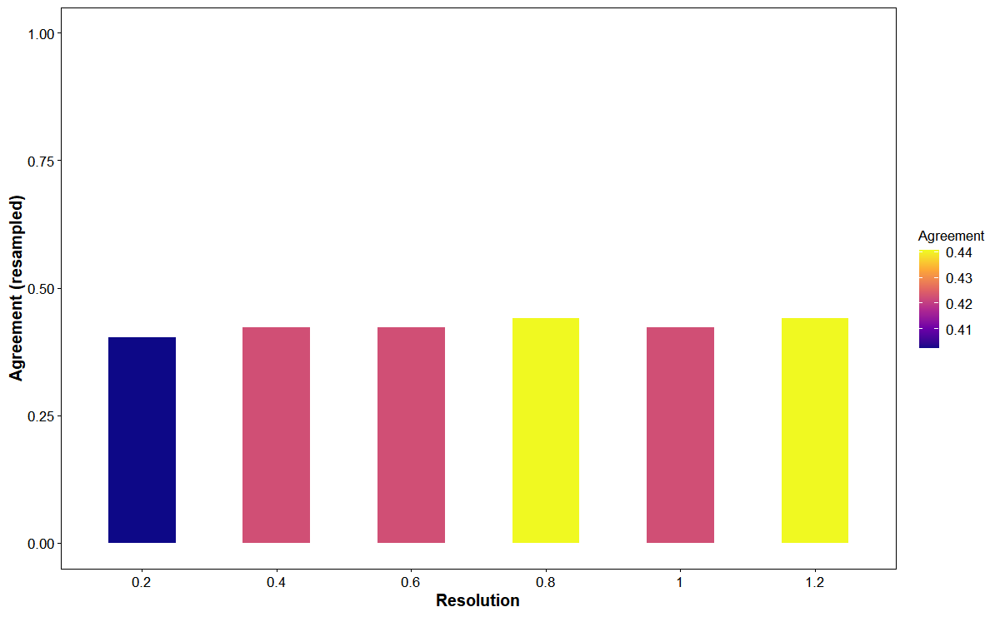<!-- -->

``` r
head(res$summary)
#> # A tibble: 6 × 2
#>   resolution agreement
#>        <dbl>     <dbl>
#> 1        0.2     0.402
#> 2        0.4     0.422
#> 3        0.6     0.422
#> 4        0.8     0.441
#> 5        1       0.422
#> 6        1.2     0.441
```

### VisMarkerAtlas

``` r
res <- VisMarkerAtlas(
  obj,
  markers_top = 5,
  logfc_threshold = 0.25,
  min_percent = 0.1,
  test_method = "wilcox",
  palette = "C"
)
#> Calculating cluster 0
#> For a (much!) faster implementation of the Wilcoxon Rank Sum Test,
#> (default method for FindMarkers) please install the presto package
#> --------------------------------------------
#> install.packages('devtools')
#> devtools::install_github('immunogenomics/presto')
#> --------------------------------------------
#> After installation of presto, Seurat will automatically use the more 
#> efficient implementation (no further action necessary).
#> This message will be shown once per session
#> Calculating cluster 1
#> Calculating cluster 2
#> Calculating cluster 3
#> Calculating cluster 4
#> Calculating cluster 5
#> Calculating cluster 6
#> Calculating cluster 7
#> Calculating cluster 8
#> Calculating cluster 9
#> As of Seurat v5, we recommend using AggregateExpression to perform pseudo-bulk analysis.
#> First group.by variable `ident` starts with a number, appending `g` to ensure valid variable names
#> This message is displayed once per session.

res$plot
```

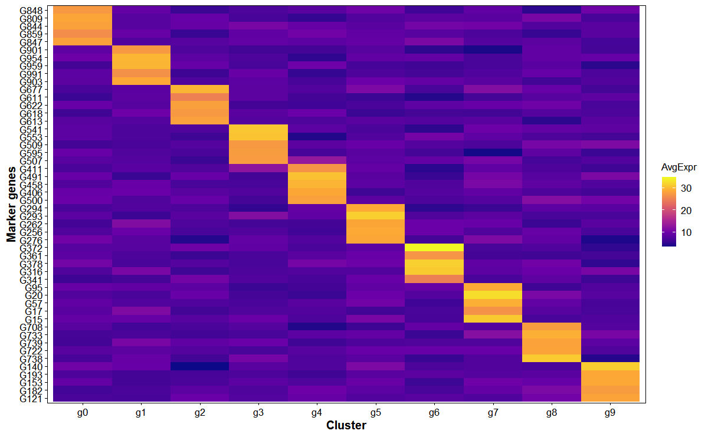<!-- -->

``` r
head(res$markers)
#> # A tibble: 6 × 7
#>      p_val avg_log2FC pct.1 pct.2 p_val_adj cluster gene 
#>      <dbl>      <dbl> <dbl> <dbl>     <dbl> <fct>   <chr>
#> 1 9.50e-19       1.80 1     0.622  9.50e-16 0       G848 
#> 2 1.86e-17       1.83 0.976 0.622  1.86e-14 0       G809 
#> 3 1.92e-17       1.62 1     0.653  1.92e-14 0       G844 
#> 4 3.46e-17       1.69 1     0.653  3.46e-14 0       G859 
#> 5 3.79e-17       1.73 0.976 0.653  3.79e-14 0       G847 
#> 6 5.19e-19       1.97 1     0.563  5.19e-16 1       G901
```

### VisBatchAlign

``` r
obj$batch <- sample(c('A','B'), ncol(obj), replace = TRUE)

res <- VisBatchAlign(
  obj,
  batch = 'batch',
  reduction = 'pca',
  dims = 1:10,
  k = 20,
  palette = "C",
  violin_width = 0.8,
  violin_alpha = 0.3,
  box_width = 0.3,
  box_alpha = 0.5
)

res$plot
```

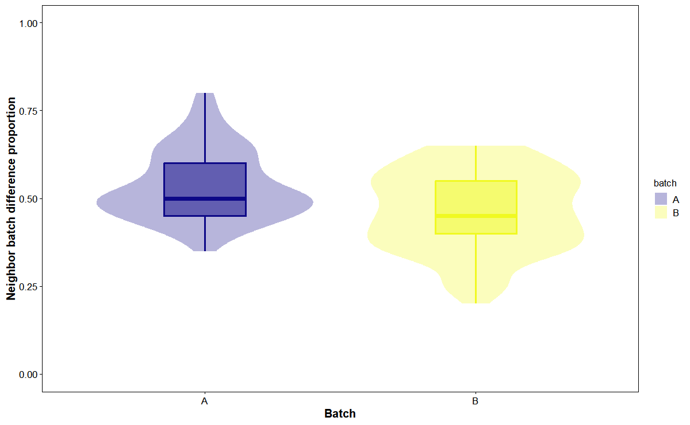<!-- -->

``` r
head(res$summary)
#> # A tibble: 6 × 3
#>   cell  mix_prop batch
#>   <chr>    <dbl> <chr>
#> 1 Cell1     0.5  A    
#> 2 Cell2     0.6  B    
#> 3 Cell3     0.45 A    
#> 4 Cell4     0.6  A    
#> 5 Cell5     0.5  B    
#> 6 Cell6     0.55 A
```

### VisGeneTrend

``` r
p <- VisGeneTrend(
  obj,
  features = c("G10", "G20", "G30"),
  by = "pseudotime",
  reduction = "umap",
  dims = 1:2,
  smooth.method = "loess",
  palette = "C",
  point_size = 2,
  point_alpha = 0.3,
  smooth_alpha = 0.3,
  smooth_linewidth = 1.5
)

p
#> `geom_smooth()` using formula = 'y ~ x'
```

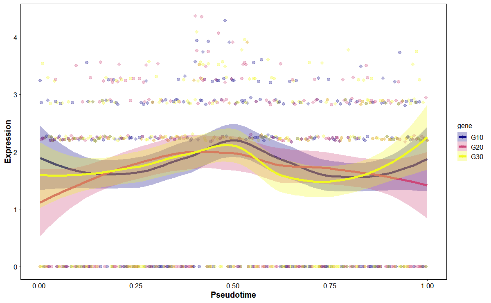<!-- -->

### VisLigRec

``` r
lr <- data.frame(ligand = paste0('G', 1:5), receptor = paste0('G', 6:10))

res <- VisLigRec(
  obj,
  assay = NULL,
  lr_table = lr,
  group.by = "seurat_clusters",
  palette = "C",
  tile_alpha = 0.8
)

res$plot
```

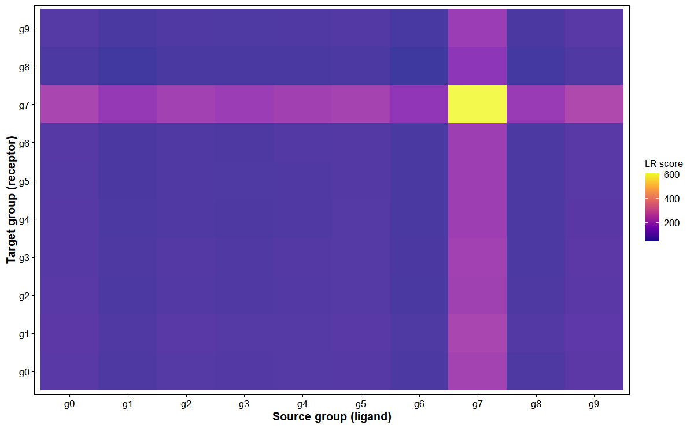<!-- -->

``` r
head(res$scores)
#> # A tibble: 6 × 3
#>   source target score
#>   <chr>  <chr>  <dbl>
#> 1 g0     g0      74.8
#> 2 g0     g1      80.5
#> 3 g0     g2      74.3
#> 4 g0     g3      74.0
#> 5 g0     g4      72.1
#> 6 g0     g5      71.4
```

### VisClusterTree

``` r
p <- VisClusterTree(
  obj,
  assay = NULL,
  group.by = "seurat_clusters",
  dist.metric = "euclidean",
  linkage = "complete",
  show_heatmap = TRUE,
  palette = "C",
  tile_alpha = 0.8
)

p
```

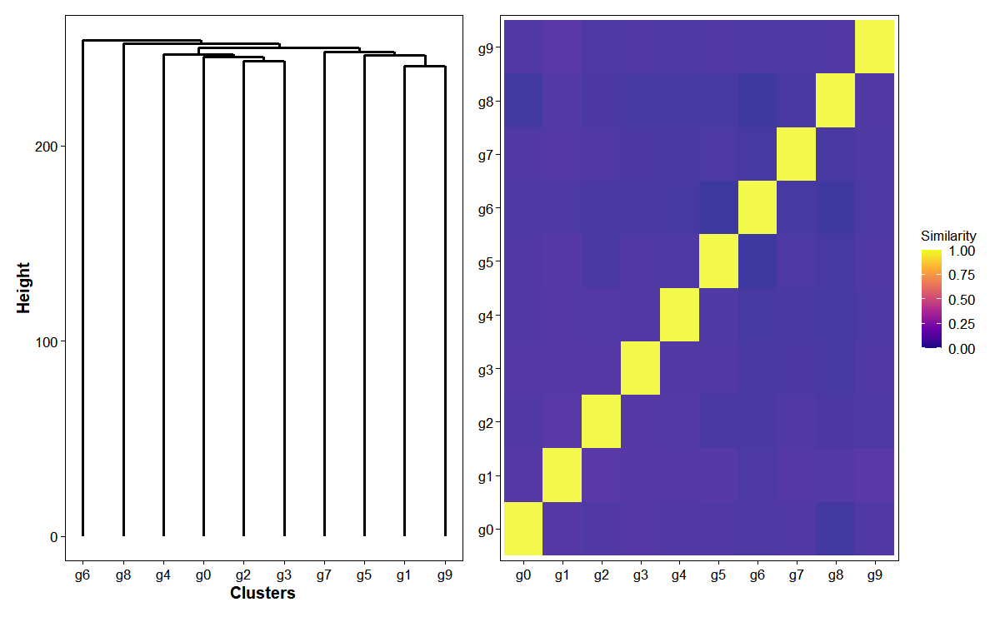<!-- -->

### VisMetaFeature

``` r
sets <- list(SetA = paste0('G', 1:10), SetB = paste0('G', 11:20))

res <- VisMetaFeature(
  obj,
  feature_sets = sets,
  group.by = "seurat_clusters",
  nbin = 24,
  min.size = 3,
  palette = "C",
  violin_width = 0.8,
  violin_alpha = 0.3,
  box_width = 0.3,
  box_alpha = 0.5
)

res$plot
```

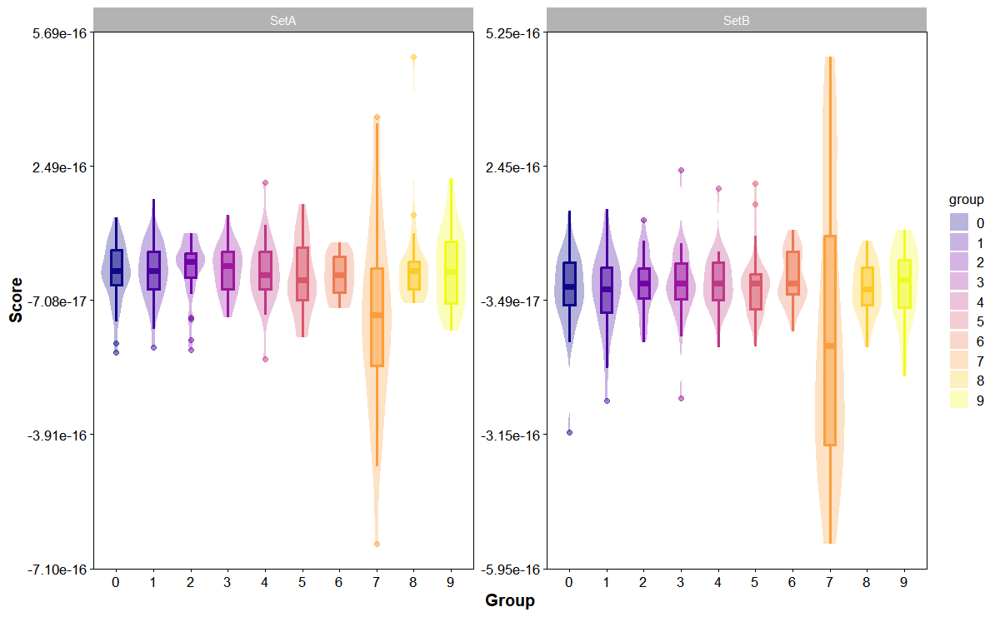<!-- -->

### VisCellCycle

``` r
genes_s <- paste0('G', 1:10)
genes_g2m <- paste0('G', 11:20)

res <- VisCellCycle(
  obj,
  genes_s,
  genes_g2m,
  reduction = "umap",
  dims = 1:10,
  palette = "C",
  alpha = 0.8
)

res$plot
```

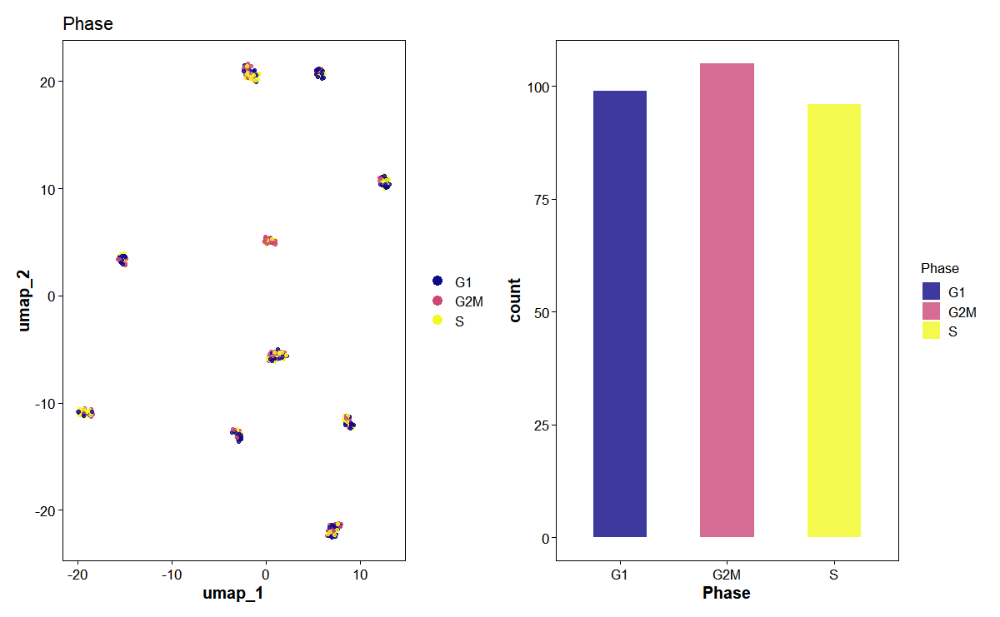<!-- -->

### VisEmbeddingContour

``` r
p <- VisEmbeddingContour(
  obj,
  group.by = "seurat_clusters",
  reduction = "umap",
  levels = 5,
  palette = "C",
  point_size = 1,
  point_alpha = 0.5,
  contour_alpha = 0.1
)

p
```

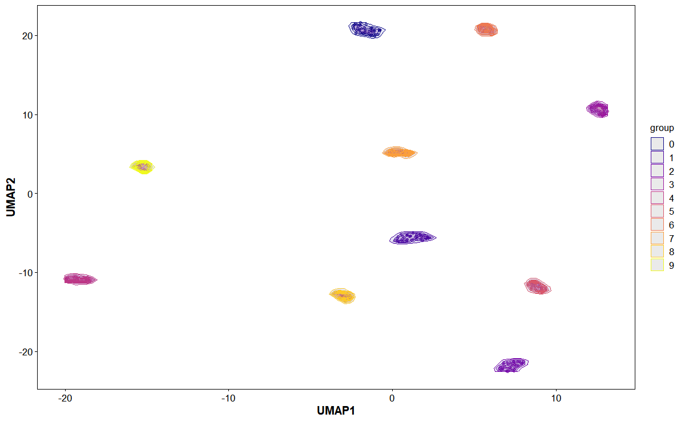<!-- -->

### VisGeneCoexpHive

``` r
p <- VisGeneCoexpHive(
  obj,
  genes = paste0("G", 1:100),
  reduction = "pca",
  threshold = 0.2,
  palette = "C",
  point_size = 3,
  point_alpha = 0.8,
  label_size = 3,
  curve_alpha = 0.5
)
#> Warning: The `slot` argument of `GetAssayData()` is deprecated as of SeuratObject 5.0.0.
#> ℹ Please use the `layer` argument instead.
#> ℹ The deprecated feature was likely used in the SeuratVisPro package.
#>   Please report the issue at
#>   <https://github.com/benben-miao/SeuratVisPro/issues>.
#> This warning is displayed once every 8 hours.
#> Call `lifecycle::last_lifecycle_warnings()` to see where this warning was
#> generated.
#> Warning: Using `size` aesthetic for lines was deprecated in ggplot2 3.4.0.
#> ℹ Please use `linewidth` instead.
#> ℹ The deprecated feature was likely used in the SeuratVisPro package.
#>   Please report the issue at
#>   <https://github.com/benben-miao/SeuratVisPro/issues>.
#> This warning is displayed once every 8 hours.
#> Call `lifecycle::last_lifecycle_warnings()` to see where this warning was
#> generated.

p
```

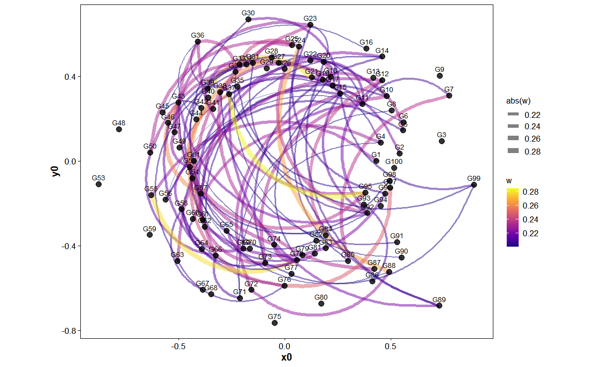<!-- -->

### VisSpatialOverlay

``` r
obj_sp <- SeuratVisProExample(n_cells = 300, n_genes = 1000, n_clusters = 10, spatial = TRUE)
#> Modularity Optimizer version 1.3.0 by Ludo Waltman and Nees Jan van Eck
#> 
#> Number of nodes: 300
#> Number of edges: 4508
#> 
#> Running Louvain algorithm...
#> Maximum modularity in 10 random starts: 0.9485
#> Number of communities: 10
#> Elapsed time: 0 seconds

p <- VisSpatialOverlay(
  obj_sp,
  features = c("G1", "G2", "G3", "G4"),
  image = NULL,
  coords_cols = c("x", "y"),
  palette = "C",
  point_size = 2,
  alpha = 0.5
)

p
```

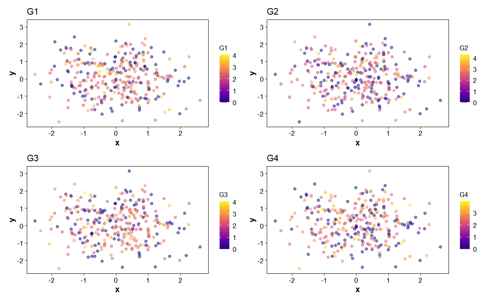<!-- -->

### VisHexEntropy

``` r
p <- VisHexEntropy(
  obj,
  group.by = "seurat_clusters",
  reduction = "umap",
  bins = 30,
  palette = "C"
)

p
```

<!-- -->

### VisLocalMoran

``` r
p <- VisLocalMoran(
  obj,
  gene = 'G10',
  reduction = "umap",
  k = 15,
  palette = "C",
  point_size = 2,
  point_alpha = 0.8
)

p
```

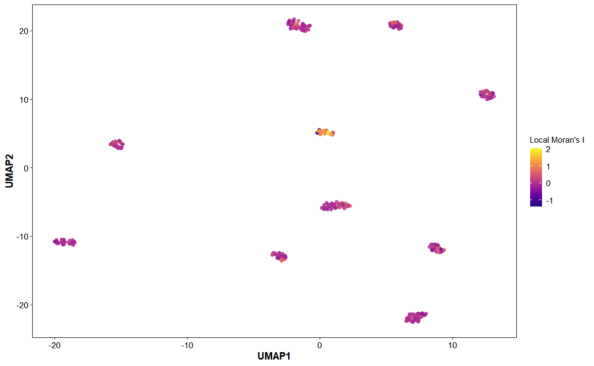<!-- -->

### VisClusterFlowGraph

``` r
p <- VisClusterFlowGraph(
  obj,
  group.by = "seurat_clusters",
  reduction = "umap",
  palette = "C",
  point_size = 7,
  point_alpha = 0.9,
  label_size = 5
)

p
```

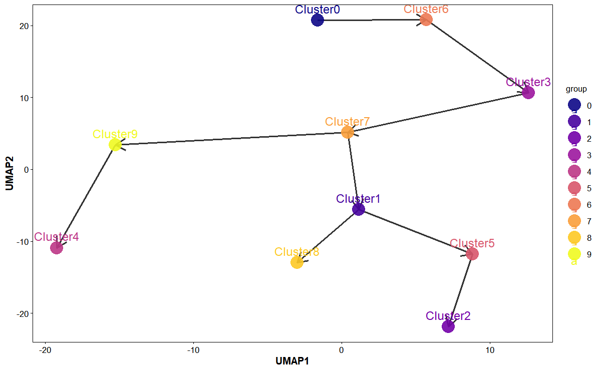<!-- -->
